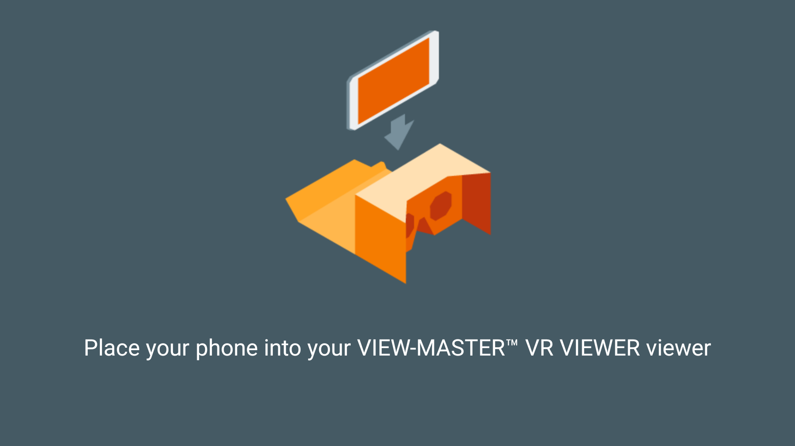
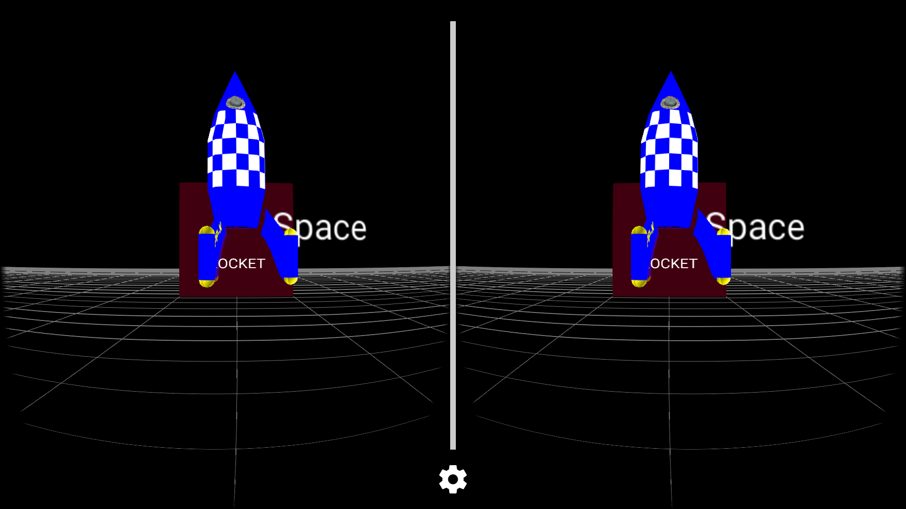
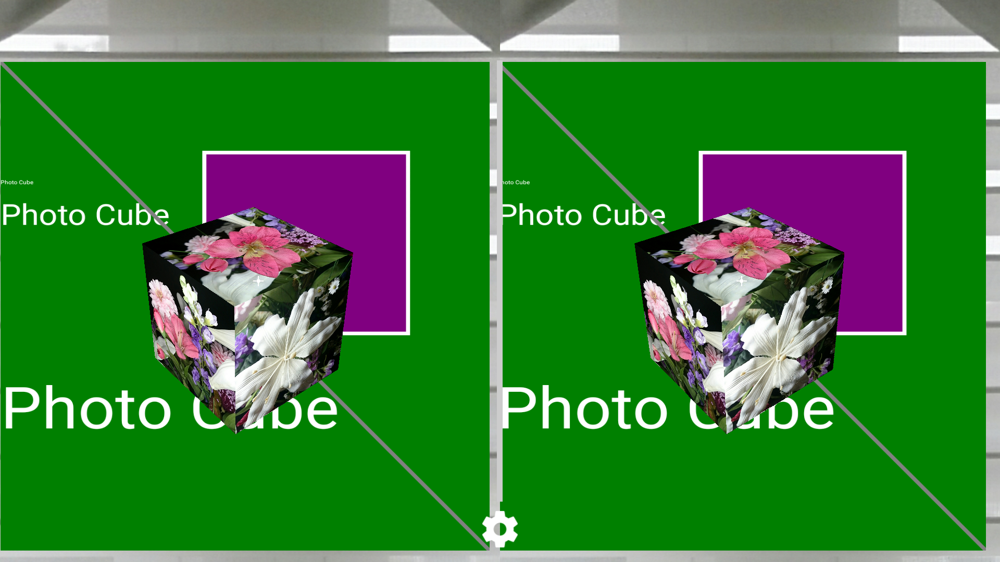
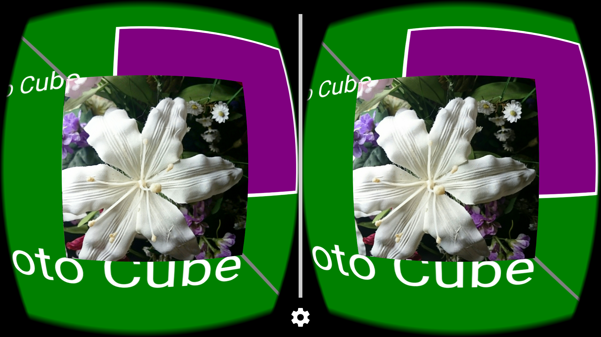

# Processing-Cardboard

This repository is an implementation of Processing-Android with Google Android Cardboard SDK.
With this code you can write Processing sketches for Android apps to use stereo graphics/photo and Google Cardboard/VR features.

 The objective of this work is to provide an easier development platform by using Processing for learning to program VR Android apps intended for the Cardboard HMD viewer.
 
 The  Processing-Android core library was modified to use the Cardboard SDK replacing the main draw thread with the Cardboard rendering thread. The Processing-Android core library has an abstraction layer for OPENGL that makes it possible to write an Android Cardboard app without using direct Android OPENGL calls. 
 
 Included are example Android apps for Google Cardboard to demonstrate coding with the Processing Language for Android library and the Google Cardboard Android SDK. 
 
 Processing with Cardboard SDK is an alternative for writing Android VR applications. 
 It is another way to build/explore/learn the Cardboard VR app development platform.
 
 

 
## Implementation
 
 * Works with Android Studio (2.1.1)
 * Google VR SDK for Android libraries version 0.8.0 (aar files included in the libs folder, replacing cardboard.jar and audio.jar)
 * Based on Processing for Android library version 3.0.0, 3.0.1, 3.0.2 RC1 Android Mode 247 (as of 2016/03/07)
   with Processing-Android core source code from: https://github.com/processing/processing-android.
 * Based on Stereo library source code from: https://github.com/CreativeCodingLab/stereo
 * Minimum builds supports Android API 4.4 (19) platform and above. AndroidManifest.xml is set for Kitkat 4.4 (19)
 * Tested with Sony Z1S phone, 1920 x 1080 pixel display, running Android version 5.0.2, with GPU hardware accelerator
 * Tested with Samsung Galaxy S6 phone, 2560 x 1440 pixel display, running Android version 5.1.1
 
## Processing-Android Modifications

 * Modified the Processing-Android core Library to work directly with the Gooble VR SDK for Android (Cardboard).

 * PApplet extends GvrActivity
 
 * The main display thread used by Cardboard SDK for its display rendering replaces the display thread 
 in Processing-Android that calls draw().

 * Added draw functions for left and right eye in Processing

 * SketchSurfaceView extends GvrView

 * SketchSurfaceViewGL extends GvrView

 * CardboardView rendering uses GvrView.StereoRenderer

 * GvrView.Renderer code is also available but not used.

 * Added PStereo class for stereo view control
  
 * Added headtransform(), drawleft(), drawright() functions to Processing
  
 * Added external keyboard codes for remote Bluetooth controller key press.
 
 * Moved processing/opengl/shaders folder to assets folder

 * The following Processing-Android core files were modified for this conversion:
 
    - PGL.java,  
    - PGLES.java  
    - PGraphicsOpenGL.java
    - PApplet.java
    - PConstants.java
    - PGraphics.java
    - PGraphicsAndroid2D.java
    - PImage.java
 
## Example App Description
 
The repository has two example apps. 

MainActivity displays a stereo photo cube in front of a stereo photo background. 
In the cardboard viewer the user may change the viewing angle and size of the cube with head movement. 
A screen tap will bring the cube back to its original location. 
Tilting the HMD viewer left or right will change the cube size.
The app examples also show how to display text and graphics (reticle).

No distortion correction:

Distortion correction enabled:

## Issues:
 
  1. Out of memory can result when using large images or restarting the app.
 
## Updates:
 
### 2016/04/01

  1. Distortion correction can be enabled, but the eye separation may need adjustment for viewing.
  The display may not be distorted enough to matter with some Unofficial cardboard viewer lens and
   home made Cardboard viewer with stereoscopic quality wide field of view lens.
  2. Text and line drawing now work on screen directly in the correct eye viewport.
  3. Modifications to use Cardboard libraries version 0.7.0.
  
### 2016/05/21
  
  1. Modifications for Google VR SDK for Android (Cardboard) version 0.8.0

## Notes:
 The magnet pull trigger does not work well with my phone so I use new convert tap to trigger feature
 available in Cardboard V2.
 
 No library build was defined here to make a Processing Android SDK library for use with a desktop computer.
 
 Must use minimum Android 4.4 (19) with version 0.8.0. This is also better for faster image/photo processing and display

## Usage Example
I wrote a simple demonstration arcade game/simulation for Google Cardboard VR based on the code here. Check it out at:

https://play.google.com/store/apps/details?id=com.modla.andy.swarm3dfree

## Credits

 Processing Foundation  http://processing.org
 
 Creative Coding Lab is the EVL Creative Coding Research Group at The University of Illinois at Chicago https://www.evl.uic.edu/creativecoding/about.php
 
 Cardboard is a trademark of Google Inc. http://google.com/cardboard 
 
 View-Master is a trademark of Mattel Inc.
